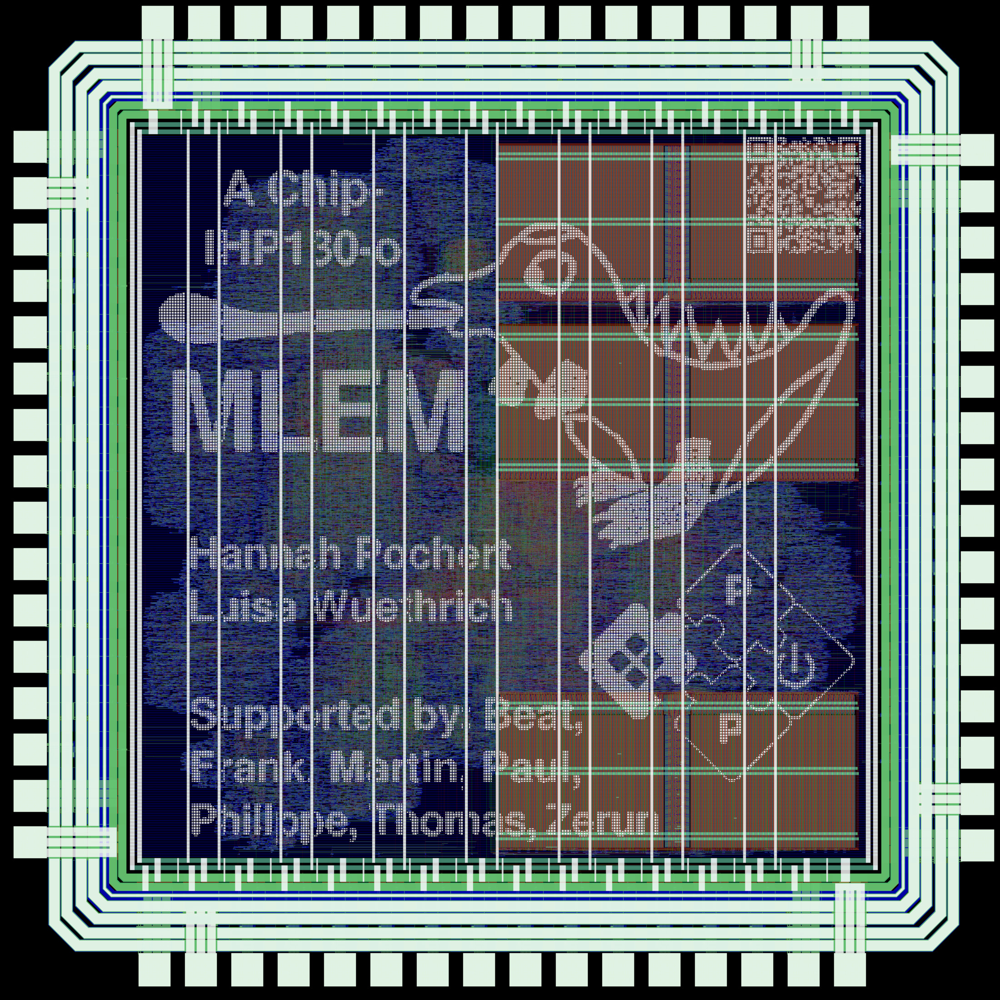

# MLEM

[MLEM](http://asic.ethz.ch/2024/MLEM.html), named after the sound Yoshi (from Super Mario) makes when eating a tasty fruit, is the first tapeout based on the [Croc SoC platform](https://github.com/pulp-platform/croc). MLEM was designed and prepared for tapeout by students using a complete open- source tool flow, including a new SystemVerilog frontend for [Yosys](https://yosyshq.net/yosys/) developed by [Martin Poviser](https://github.com/povik/yosys-slang). This chip serves as a pilot for the new [Open VLSI Lecture](https://vlsi.ethz.ch/) due to start in 2025, where students get the opportunity to prepare a Croc tapeout with any custom addition they may choose to add in [IHP 130nm Open PDK](https://github.com/IHP-GmbH/IHP-Open-PDK).

## Example Output

