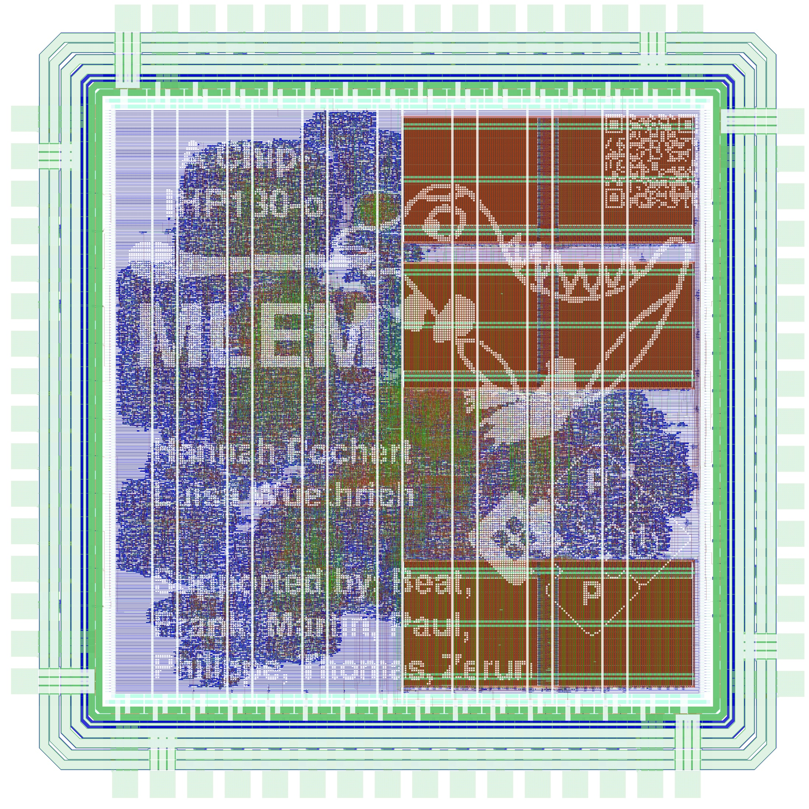
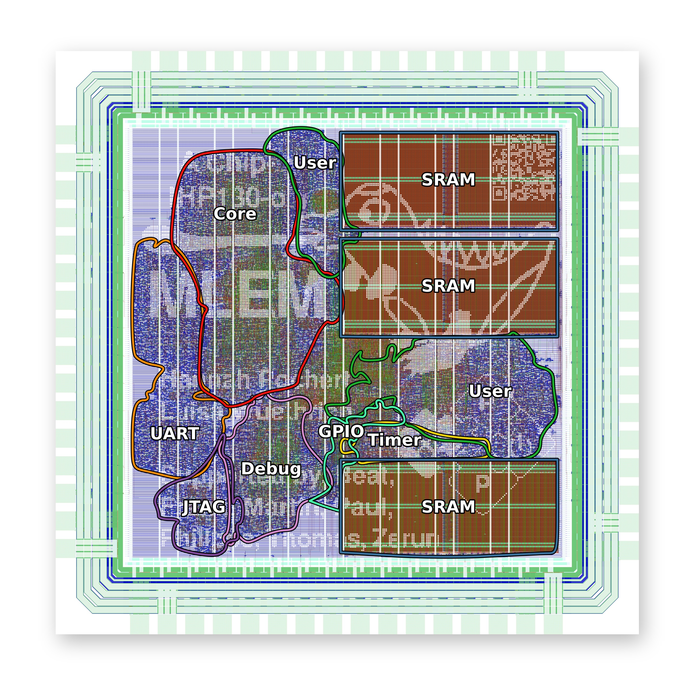

# MLEM

[MLEM](http://asic.ethz.ch/2024/MLEM.html), named after the sound Yoshi (from Super Mario) makes when eating a tasty fruit, is the first tapeout based on the [Croc SoC platform](https://github.com/pulp-platform/croc). MLEM was designed and prepared for tapeout by students using a complete open- source tool flow, including a new SystemVerilog frontend for [Yosys](https://yosyshq.net/yosys/) developed by [Martin Poviser](https://github.com/povik/yosys-slang). This chip serves as a pilot for the new [Open VLSI Lecture](https://vlsi.ethz.ch/) due to start in 2025, where students get the opportunity to prepare a Croc tapeout with any custom addition they may choose to add in [IHP 130nm Open PDK](https://github.com/IHP-GmbH/IHP-Open-PDK).

## Run the Example

From the ArtistIC directory, with Python 3.11+, Pillow, img2pdf, KLayout,
Inkscape and potrace available:

```sh
make PROJECT=examples/mlem/project.toml all
```

This runs inspection, logo placement, rendering, module annotation, and the
full 12288-pixel map. `work/` also contains the palette preview, physical logo
SVG, an 84.1 cm-wide PDF, and a four-sheet A4 poster. The macro LEF is a
bounding-box fixture for annotation only, not a physical-design model.

The default example uses the original PNG artwork at 1576 um, isolated 4 um
metal squares on a 6 um grid, and the original -100..2100 um render viewport.
White remains the default background. The images below are generated by this
configuration, including labels placed inside each traced region.

## Compare the Legacy Renderer

`legacy-render.toml` isolates rendering from changes to logo geometry. Place
the chip GDS from the old logo flow at `legacy/mlem_chip.gds.gz`, then run:

```sh
make PROJECT=examples/mlem/legacy-render.toml render-generate render-compose
```

This uses the old black background, viewport, 2x2 processing segments,
overrender factor, colors, and 84.1 cm paper width. Raw masks can be compared
directly; the final image uses Lanczos downsampling rather than the old box
downsampling. The new spaced-square logo is intentionally not polygon-identical
to the legacy primitive-based logo. Do not compare full chip images with
different logo GDS inputs as a renderer equivalence test.

## Example Output




